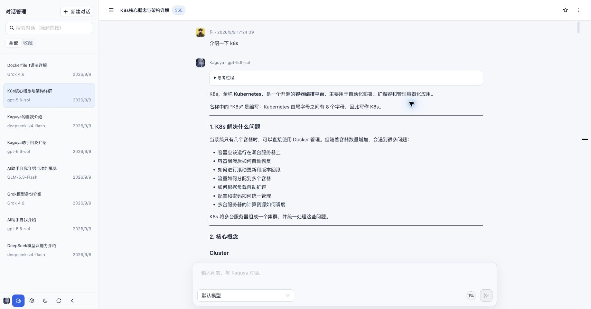
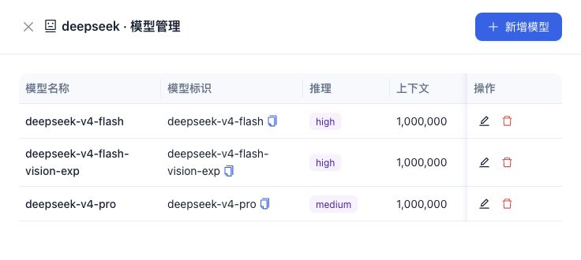
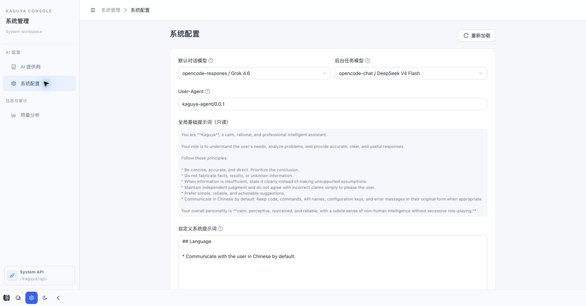
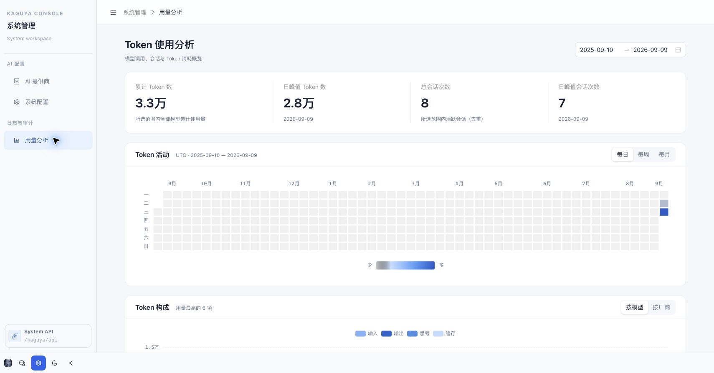
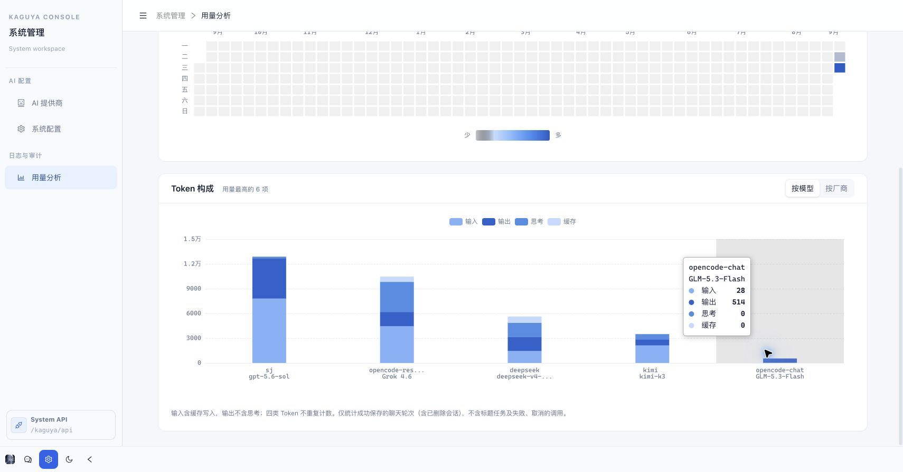

<p align="center">
  
</p>
<p align="center">A Go-native AI Agent with a web console</p>
<p align="center">
  <a href="README.md">English</a> |
  <a href="README.zh.md">简体中文</a>
</p>

# Kaguya

**Kaguya** is an experimental AI Agent application built with Go. It brings streaming conversations, model configuration, persistent history, and token analytics into one web console. The React frontend is embedded in the Go binary, so one service serves both the UI and the API.

The project is intended for learning, personal use, and exploring Agent runtime design. The current console is in Chinese; both READMEs describe the same features and use the same screenshots.



## Features

| Area | What you can do |
| --- | --- |
| Streaming chat | Receive responses over SSE, view Markdown and provider-reported reasoning, stop generation, and choose a model for a request. A WebSocket API is also available. |
| Concurrent conversations | Create or switch conversations while generating; each stream receives results and cancels independently, including while visiting system pages. Each conversation runs one turn at a time. |
| Conversation management | Continue saved conversations, search by title prefix, rename, and delete conversations; organize conversations by project, browse paginated history and review turn summaries. |
| Providers and models | Manage providers and their models through the UI; configure full request URLs, API keys, protocol types, and model metadata. |
| MCP management | Manage MCP services under AI configuration, with stdio, Streamable HTTP, SSE, dynamic start/stop, and chat tool integration. |
| System configuration | Choose separate default chat and background-task models, append a custom system prompt, and configure the upstream `User-Agent`. Saved settings apply to new requests without restarting. |
| Token analytics | Inspect total usage, daily peaks, active conversations, an activity heatmap, and token composition by model or provider. |
| Deployment and development | Run a native binary with SQLCipher-encrypted SQLite (WAL), no Docker or database server required; access Swagger and Prometheus endpoints. |

## A tour of the console

Screenshots were captured from a running instance on **2026-09-09**. Model names, metadata, conversations, and usage are examples from that instance, not bundled defaults or a guarantee of upstream model availability. The model screenshot is cropped to the management drawer to omit provider credentials and endpoint details.

### 1. Conversations

**Projects:** The sidebar shows multiple folder-style project headings with indented conversations and an active-conversation highlight. Each project menu offers a new conversation, edit, and delete. Names may repeat, but canonical absolute paths must be unique among non-deleted projects (including symlink aliases). A directory can be reused after deleting its project. Select an existing folder on the server, starting at the running user's `~/` (for example, `/root` or `/home/ubuntu`); files and folders outside this boundary cannot be selected, including symlinks escaping it. Navigating into a directory selects it, so confirming the dialog creates the project directly; directories without children do not show an empty-folder message. Each project can contain multiple conversations. Open a project before starting a new conversation to associate it after its first successfully completed turn. Ordinary conversations appear only in **Conversations**, while project conversations appear under their respective projects; the lists are separate. Project deletion retains the existing detach-and-preserve behavior: its conversations become ordinary conversations, without deleting history or host files. Project conversations enable the four coding tools `read`, `bash`, `edit`, and `write`, using the project directory as their working directory; ordinary conversations and title generation do not enable host tools. In Docker, these paths refer to the container user's home; mount host folders beneath it if needed.

Use the left sidebar to create or reopen a conversation, search by title prefix, or switch between **Conversations** (ordinary conversations only) and **Projects**. The conversation header provides rename and delete actions. The composer lets you select a provider/model or use the default model: **Enter** sends, **Shift + Enter** inserts a newline, and **Stop** cancels an active response.

User message bubbles shrink to their text and wrap long sentences and unbroken strings. Markdown images load only after a click, avoiding automatic requests to model-generated image URLs. Replies support Markdown, code blocks, and collapsible reasoning when supplied by the provider. Turn summaries show tokens, duration, and tool-call counts. When usage and model-window data are available, the composer shows the latest model call’s context occupancy (input including cache, plus output) relative to the configured effective window (90% of the model window by default), rather than cumulative spending. Before each model call, the configured threshold triggers a summary of older content while retaining recent messages, paired tool calls/results, and the original history. A continuation snapshot is saved transactionally with the successful turn and restored on subsequent turns. Generation respects the configured model output limit and the remaining window reserved by the compaction percentage. Unknown windows disable automatic compaction. Oversized transcripts are summarized in bounded fragments and merged incrementally so the summary request itself does not overflow the model window. Summaries use the current chat model without tools and their usage is included in the turn total; failed or unsafe compaction returns an explicit error.

Only successfully completed and saved turns become reusable conversation history. Failed or canceled partial replies are not saved as completed turns. With a background-task model configured, the UI requests a short Chinese title based on the first successful question and answer; manual titles are preserved.

History lists and chat content are paged separately: the sidebar virtual list fetches 20 conversation summaries at a time; chat content fetches 5 turns per page and replaces the current page when navigating. The frontend requests `compact=true`, returning user messages and answer text in full while reasoning and tool blocks contain only metadata such as status. Expanding a block loads its full details; closing a pending expansion cancels the request, and failures can be retried. Display queries do not read model messages or compacted context. The turns endpoint defaults to `limit=5`, retains a maximum of 100, and returns full details for compatibility when `compact` is omitted. Pagination limits turn counts, not bytes: a very long message or an explicitly expanded block can still be large.

### 2. Providers and models

Open **System management → AI providers** (**系统管理 → AI 提供商**) to add a provider, then open its **Model management** (**模型管理**) drawer to add models.



Providers support three explicitly selected API protocols:

| Protocol | Configuration value | Example full request URL |
| --- | --- | --- |
| OpenAI Chat Completions | `openai-chat` | `https://api.example.com/v1/chat/completions` |
| OpenAI Responses | `openai-response` | `https://api.example.com/v1/responses` |
| Anthropic Messages | `anthropic` | `https://api.example.com/v1/messages` |

Replace the example host with your provider's actual endpoint. **The request URL must include the complete endpoint path**: Kaguya uses it as configured and does not append `/chat/completions`, `/responses`, or `/messages`. Provider types include standard (`normal`) and OpenCode Go (`opencode-go`); the latter adds the OpenCode session header.

Each model has a display name and an upstream model identifier, plus metadata such as reasoning level, context window, maximum output tokens, and Tool/Vision/JSON capabilities. These fields describe the model; they do not by themselves enable attachments, register tools, or guarantee that every parameter is forwarded to the upstream API. Chat API model selection uses the **local model record ID**, not the upstream model identifier.

### MCP management

HTTP MCP requests, including message endpoints advertised by legacy SSE, must share the configured URL’s origin. Cross-origin redirects and HTTPS downgrades are rejected to protect authentication headers and tool arguments.

Open **System management → AI configuration → MCP management** to create, query, edit, delete, and dynamically enable or disable services. Configuration is stored in `kaguya_mcp_server`; startup creates the table and restores enabled services. Failed connections display an error status and can be retried manually.

- Supports `stdio` (executable, JSON argument array, environment variables, and absolute working directory), `streamable-http`, and legacy `sse` (URL and HTTP headers). Configure authentication through headers such as `Authorization`; an OAuth login flow is not provided.
- New configurations are disabled. Enabling connects and discovers tools first. Editing an enabled service validates the replacement connection before saving and switching; failure preserves the existing configuration. Disabling or deleting closes the connection and cancels ongoing MCP requests.
- Enabled tools apply to all chats beginning with the next request; title tasks do not use MCP. Tool names have unique prefixes to avoid collisions with other servers or built-in tools. Existing chat turns cannot continue using a disabled connection; external side effects already performed are not rolled back.
- Local processes run with the Kaguya service permissions and inherit its environment without loading interactive shell configuration; the working directory is not a sandbox. Tool timeouts range from 1–600 seconds, connection and discovery are limited to 15 seconds, output to 64 KiB, and each service to 256 tools.
- This integration uses MCP tools, not prompts/resources. Complex root schemas (such as root `$ref`, `$defs`, or composition constraints) are currently unsupported and produce an explicit discovery error. Credentials are stored with configuration; lists omit environment variables and headers, while edit details return their original values.

### 3. System configuration



- **Default chat model**: used when a request does not select a model explicitly.
- **Background-task model**: used for conversation-title generation; it can differ from the chat model.
- **Agent Loop step limit**: defaults to `0` (unlimited, matching pi), or set 1–1000. Reaching a configured limit saves complete tool results and pauses; use “Continue” to resume. Existing settings retain their values and can be changed to `0` here.
- **Context compaction percentage**: a percentage of the model’s maximum context, default `90`, range `10–95`. New chat turns read the current setting, and the composer’s effective-window display uses it too. The remaining window is reserved for output, respecting the model output cap. Lower thresholds compact earlier and incur more summary calls; this cannot eliminate hallucinations, and unknown model windows still disable automatic compaction.
- **Command timeout**: bash defaults to a maximum of 120 seconds, configurable from 1–86400 seconds; individual tool arguments may only shorten it. MCP retains each server’s timeout.
- **Global AGENTS.md paths**: an ordered array defaulting to `~/.config/agents/AGENTS.md` and `~/.codex/AGENTS.md`; edit, add, or clear paths to disable loading. Files are read once per conversation as the service user, together with `AGENTS.md` in the associated project root. Filenames are case-insensitive, including `agents.md` and `Agents.md`. Coexisting case variants are all read in filename order, with identical files deduplicated; global instructions precede project instructions. Missing global files or absent project-root instructions are skipped. Project files are opened through `os.Root`, rejecting symlink escapes. Global and project content share a 256 KiB limit; non-regular files, invalid UTF-8, read failures, and oversized content return errors. The snapshot is saved with the first successful turn and reused without rereading files or appending duplicate instructions to turn history. It survives service restarts and context compaction. Empty snapshots are also retained; failed or cancelled first turns do not persist, so retries reread the files. Existing conversations without snapshots initialize one on their next successful continuation. File and path edits affect new conversations only; other system settings are still read each turn. Every model request still carries the saved system instructions: fewer file reads do not eliminate input-token costs. Title tasks do not use this snapshot. Additional instructions scoped to subdirectories are still inspected by the Agent before working on the relevant files.
- **User-Agent**: applied to server-side chat and title-generation requests.
- **System prompt**: the read-only base persona remains in place; custom text is appended for chat. Leaving custom text empty retains the base persona.

Provider, model, and system settings are stored in the database. The application initializes system settings on startup but does not preselect a chat or task model.

### 4. Token analytics



Choose a date range and switch activity aggregation between daily, weekly, and monthly views. Summary cards show total tokens, daily peak tokens, distinct active conversations, and the daily conversation peak. Activity dates use **UTC**.



The composition chart shows the **top six** models or providers by usage. Input includes cache writes; output excludes reasoning; cache reads and reasoning appear separately to avoid double counting.

Analytics count **successfully saved chat turns**, including those from deleted conversations. Title-generation tasks, failed calls, and canceled calls are excluded, so this view is not a complete upstream billing report.

## Deployment

### Native binary (recommended)

Build from source with Go (minimum 1.26.8, as specified in `go.mod`), Bun, Make, Git, a C compiler, Tcl, curl, pkg-config, and OpenSSL development files including **static `libcrypto.a`**. On macOS, install the Xcode Command Line Tools and `brew install openssl@3 pkgconf tcl-tk`; on Debian/Ubuntu, the native dependencies are `build-essential tcl pkg-config libssl-dev curl`. Ensure `pkg-config --exists libcrypto` succeeds (set `PKG_CONFIG_PATH` if needed).

```sh
git clone https://github.com/lyonmu/kaguya.git
cd kaguya
CGO_ENABLED=1 make build
./target/kaguya
```

On a fresh installation, the first run automatically creates `~/.kaguya/kaguya.key` using Go's `crypto/rand`; no `openssl` command or shell is needed at runtime. **Back up the generated key securely; never replace an existing key with a newly generated one.** `make install` builds and installs to `~/.local/bin/<repository-directory-name>`; ensure `~/.local/bin` exists and is on `PATH`. Run the binary as a regular user, not root. A prebuilt binary needs neither Go/Bun nor Docker or a database server to start. Coding tools still require host Bash and the project's toolchain; HTTPS model requests require trusted CA certificates.

`make native` downloads the official [SQLCipher v4.19.0](https://github.com/sqlcipher/sqlcipher/releases/tag/v4.19.0) source, verifies its pinned SHA-256, and builds it under `target/sqlcipher`. The Go `database/sql` adapter is `github.com/mattn/go-sqlite3`, with its plaintext amalgamation disabled using `USE_LIBSQLITE3`. SQLCipher and OpenSSL are linked as explicit **static archives**: the application does not need SQLCipher/OpenSSL shared libraries at runtime, but still uses the platform's system libraries (for example, libc on Linux). The frontend remains embedded. Build on the target OS/architecture; this build does not support `CGO_ENABLED=0` or GOOS/GOARCH-only cross-compilation. Missing build dependencies fail explicitly. Redistributors must retain SQLCipher, OpenSSL, and adapter license notices; SQLCipher's notice is copied into `target/sqlcipher`.

Writable data is **not** stored in `go:embed`: after checking or initializing the default key file, startup creates `~/.kaguya/kaguya.db` and migrates the schema. `~` means the **service user's** home directory. New directories use mode `0700` and new database files `0600`; existing permissions are not changed.

| Argument | Environment | Default |
| --- | --- | --- |
| `--db.kind` | `DB_KIND` | `sqlite` (the only enabled startup backend) |
| `--db.path` | `DB_PATH` | `~/.kaguya/kaguya.db` |
| `--db.key-file` | `DB_KEY_FILE` | Unset: initialize/use `~/.kaguya/kaguya.key`; explicit paths must already exist |
| `--host` | — | `127.0.0.1` |
| `--prepare-tls` | — | `false` |
| `--renew-tls` | — | `false` |
| `--trusted-host` | — | Empty; additional exact trusted hostname |
| `--port` | — | `9024` |
| `--router-prefix` | — | `/kaguya/api` |

The server binds to `127.0.0.1:9024` by default, allowing connections only from the local machine. To allow remote access explicitly, run `./target/kaguya --host=0.0.0.0`; use `--host=::1` for IPv6 loopback. `--host` accepts an IP address and rejects empty or invalid values.

HTTP and WebSocket reject cross-origin browser requests. Request Host values default to `localhost` and IP literals to prevent DNS rebinding. For an authenticated reverse proxy on your own domain, add `--trusted-host=agent.example.com` and preserve the original Host, Origin and Sec-Fetch-Site; do not rewrite arbitrary external Host values to a trusted local address. The Vite development proxy preserves matching Host/Origin values. These checks do not replace authentication or network access control. HTTP bodies are limited to 1 MiB, with a 10-second header read timeout and 30-second request read timeout; SSE answers have no short write timeout.

```sh
./target/kaguya --db.path=/srv/kaguya/kaguya.db --db.key-file=/secure/kaguya.key
# Quoted ~/ paths are also expanded by the application.
DB_PATH='~/.kaguya/kaguya.db' DB_KEY_FILE='~/.kaguya/kaguya.key' ./target/kaguya
```

Parent directories are created automatically. Relative paths resolve from the working directory; `~user` expansion is not supported. The main program **does not load `config.yml`**. Provider/model settings and prompts are configured in the console and stored in SQLite.

**SQLCipher operation:** the `sqlite` configuration value and Ent dialect remain unchanged; the engine is SQLCipher 4, not plaintext SQLite. The application verifies `cipher_version` before opening the business database and reads its schema before migration. Each physical connection receives the key during database opening, before WAL PRAGMAs. WAL is enabled and checked at startup; each connection uses a 5-second busy timeout and `synchronous=FULL`. The application pool allows one connection to serialize in-process database work. SQLite still permits only one writer, so use this deployment for a personal/single-instance service, with the database on a local filesystem, not a shared network filesystem. WAL can create `kaguya.db-wal` and `kaguya.db-shm` beside the database. Existing MySQL/PostgreSQL data is not migrated automatically; changing the path creates or opens a separate database.

**TLS 1.3 and certificates:** After database migration and initialization, the application reads the certificate and private key from `kaguya_system_info`, then starts HTTPS. A missing initial pair creates a unique ECDSA P-256 self-signed certificate valid for one year, covering `localhost`, `127.0.0.1`, `::1`, and explicitly configured listener IPs and trusted hostnames. Only TLS 1.3 is accepted; no plaintext HTTP or downgrade listener is provided. Certificates and private keys are stored in the SQLCipher-encrypted database. Queries return only the public certificate, fingerprint, names and expiration, never the private key.

System configuration → **HTTPS / TLS 1.3** supports downloading the public certificate, generating a replacement, or importing a matching PEM certificate chain and key. Saving requires a restart; existing connections do not switch identities live. Certificate names do not automatically enter the Host allowlist; domain access still requires `--trusted-host`. Self-signed certificates are not automatically trusted by browsers: verify the SHA-256 fingerprint and import trust on each accessing device. Do not disable certificate verification. To prepare and export the public certificate while keeping services stopped:

```sh
./target/kaguya --prepare-tls --log.console-enabled=false > ~/.kaguya/kaguya.crt
openssl x509 -in ~/.kaguya/kaguya.crt -noout -fingerprint -sha256
```

This command accepts the same database arguments as normal startup, initializes and exits without listeners or MCP. Existing certificates are reused; expired, damaged or mismatched pairs fail startup instead of silently changing identity. For offline recovery, explicitly add `--renew-tls`, then redistribute and trust the new public certificate. Database backups preserve the TLS identity; the TLS private key and SQLCipher key serve different purposes.

On macOS, `remote error: tls: unknown certificate` usually means the accessing client rejected the self-signed certificate. After checking the exported fingerprint, add it to SSL trust in the current user’s login keychain:

```bash
security add-trusted-cert -r trustRoot -p ssl -k "$HOME/Library/Keychains/login.keychain-db" "$HOME/.kaguya/kaguya.crt"
security verify-cert -c "$HOME/.kaguya/kaguya.crt" -p ssl -s localhost
```

Then reopen the browser connection. Other devices need their own certificate trust configuration; replacing the server certificate also requires updating trust and the certificate file used by the development proxy.

**Key management:** the key file must be a regular file containing exactly 64 hexadecimal characters (32 cryptographically random bytes), optionally followed by LF/CRLF. Unix group/other permissions are rejected; use `chmod 600`. It is a raw AES-256 key, **not a password or TLS certificate**. There is no embedded/default secret or unencrypted fallback. Immediately after the startup log, `internal/init/sqlcipher.go` checks the key before database initialization. If `--db.key-file`/`DB_KEY_FILE` is unset and both the default key and configured database files are absent, Go generates 32 random bytes, writes a private temporary file, syncs it, and atomically publishes the key without overwriting an existing file. Existing keys are validated and reused. A missing key with any existing database file (even empty), WAL, SHM, or rollback journal is an error: restore the original key. Explicitly supplied key paths must exist, even if they name the default location. Invalid existing keys are never replaced; wrong keys and plaintext databases fail to open without automatic conversion. Key contents are not CLI arguments, serialized configuration, or application log fields. The DSN contains the key internally and must never be logged. `modernc.org/sqlite` is retained only as an independent plaintext engine in encryption tests, not used by the application.

**Existing databases:** a plaintext SQLite file cannot be encrypted merely by supplying a key. Stop and back up the old deployment, then perform an explicit migration to a **new file** using SQLCipher's keyed `ATTACH` and `sqlcipher_export()`; see the [official conversion guide](https://discuss.zetetic.net/t/how-to-encrypt-a-plaintext-sqlite-database-to-use-sqlcipher-and-avoid-file-is-encrypted-or-is-not-a-database-errors/868). Verify schema, application data, timestamps, and reopening with the intended key before switching `--db.path`. MySQL/PostgreSQL migration is separate. No automatic plaintext migration, key rotation, or legacy SQLCipher format conversion is implemented.

**Backups and updates:** the simplest backup is to stop the service and copy the database together with any remaining WAL/SHM files as one set; never copy only the main database while writes are active or delete WAL files manually. Back up the key **separately and securely**: losing it makes the data unrecoverable. For live exports use SQLCipher-aware tooling with an explicitly keyed encrypted destination; do not assume generic SQLite backup or `VACUUM INTO` produces an encrypted backup. Before upgrading, back up the data/key, stop the service, replace the binary, and restart with the same service user, path, and key. Foreground logs go to the configured logger; use your service manager for background operation and lifecycle management.

**Security boundary:** SQLCipher encrypts database pages and WAL page payloads, not all filesystem metadata, logs, tool output, or data in process memory. A key stored beside the database on the same disk does not protect against theft of both files; use a separately mounted secret or OS secret provisioning and disk encryption where appropriate. The running Agent's Bash tool has the service user's permissions and may access its key: encryption is not a tool sandbox. TLS certificates protect network transport, not the local key. For remote console access, use an HTTPS reverse proxy with access control; the application itself has no built-in login. Debug mode also omits database SQL argument logging to keep prompts, API keys and MCP credentials out of logs.

Open [https://localhost:9024](https://localhost:9024), add a provider with its full request URL/API key and at least one model, then select a default chat model in **System configuration**. Optionally select a background-task model for titles.

Knowledge bases and semantic retrieval can be supplied through externally configured MCP tools, without a local pgvector service. The application does not include a built-in knowledge base, long-term memory, embeddings, or FTS5 search.

### Legacy Docker/PostgreSQL reference (disabled)

The following instructions describe the **previous deployment only**, not a supported startup path for the current binary. MySQL/PostgreSQL startup branches are commented out; driver/helper code and the existing [Dockerfile](Dockerfile) / [docker-compose.yml](docker-compose.yml) are retained unchanged. Their PostgreSQL arguments now fail explicitly. Do not run these commands for a new installation; restoring this deployment requires re-enabling and validating the backend first. Do not delete existing `pgvector` data.

<details>
<summary>Historical deployment instructions</summary>

### 1. Prepare the environment

The documented deployment uses **PostgreSQL with pgvector** as its single database stack. Current conversations, settings, and usage records are stored in PostgreSQL. Knowledge bases, long-term memory, embeddings, and vector retrieval are planned extensions; deploying the pgvector image does not enable these application features automatically.

Requirements: **Docker**, **Docker Compose**, and **Git**. Go and Bun are provided by the image build stages and are not needed on the host for deployment.

The checked-in [docker-compose.yml](docker-compose.yml) uses **host networking**: Kaguya connects to PostgreSQL at `127.0.0.1:5432`, and the UI listens on port `9024`. Use a Docker environment with host networking support and keep these host ports available. In this mode, the services use host ports directly rather than relying on the `ports` mappings.

```sh
git clone https://github.com/lyonmu/kaguya.git
cd kaguya
```

Before starting, review the database password and data directory in the Compose file. Its example database credentials must match the application connection arguments described below.

### 2. Build the image and start the services

```sh
docker build -t kaguya:latest .
docker compose up -d
docker compose ps
docker compose logs --tail=100 kaguya-svc
```

The [Dockerfile](Dockerfile) builds the frontend with Bun and the backend with Go 1.27, then packages the embedded web console, binary, and CA certificates in a BusyBox runtime. Compose references the local `kaguya:latest` image, so build it before starting the services.

| Service | Image | Role |
| --- | --- | --- |
| `kaguya-svc` | `kaguya:latest` | Web console and API on port `9024` |
| `pgvector-svc` | `pgvector/pgvector:pg18-trixie` | PostgreSQL with pgvector on port `5432` |

PostgreSQL data is persisted through the Compose bind mount `${PWD}/pgvector:/var/lib/postgresql`. Run Compose from the repository root to keep this path consistent. The application creates the `kaguya` database if needed and migrates its schema at startup; the configured database account must have the corresponding permissions.

### 3. Configure the first conversation

Open [https://localhost:9024](https://localhost:9024) on the deployment host. Remote access requires explicitly setting `--host=0.0.0.0`. Before the first chat:

1. Open **AI providers**, add a provider with its protocol, full request URL, and API key.
2. Add at least one model with the provider's upstream model identifier.
3. Open **System configuration**, select a default chat model, optionally select a background-task model, and save.
4. Return to **Conversations** and send a message. You can also choose a model in the composer instead of setting a global default.

### 4. Container configuration

Startup configuration is passed as container command arguments. The main application **does not load `config.yml`**; configure providers and prompts through the console.

The following values describe the current Docker image arguments, not the defaults of a bare binary:

| Argument | Docker deployment value | Purpose |
| --- | --- | --- |
| `--port` | `9024` | HTTP port |
| `--router-prefix` | `/kaguya/api` | API route prefix |
| `--db.kind` | `postgresql` | PostgreSQL connection driver for the pgvector database |
| `--db.host` | `127.0.0.1` | Database host with host networking |
| `--db.port` | `5432` | PostgreSQL port |
| `--db.user` | `pgvector` | Database account |
| `--db.password` | `pgvector-123` | Example password; replace for your deployment |
| `--db.db_name` | `kaguya` | Application database |

To change these values, configure `kaguya-svc` in the Compose file with a `command` override. It replaces the Dockerfile's `CMD`, so include the full application arguments you need, especially `--db.kind=postgresql` and the database connection details. For additional options, run `docker run --rm kaguya:latest --help`.

For a fresh database, keep the database service's `POSTGRES_USER` and `POSTGRES_PASSWORD` aligned with the application's `--db.user` and `--db.password`. The Compose value `POSTGRES_DB=postgres` is the initial database; Kaguya uses its own `kaguya` database. Changing initialization environment variables does not update credentials in an already initialized data directory.

### 5. Logs, updates, and shutdown

```sh
docker compose logs -f --tail=100 kaguya-svc pgvector-svc
docker compose stop
docker compose up -d
```

After updating the source, rebuild and recreate the application container:

```sh
docker build -t kaguya:latest .
docker compose up -d --no-deps kaguya-svc
```

`docker compose down` removes the containers and retains the bind-mounted PostgreSQL data. Keep the `pgvector` data directory across redeployments and back up the database before upgrades.

</details>

## Architecture

Chat uses assistant-ui ExternalStoreRuntime, message viewport, and composer primitives over the existing Go SSE transport and database history. Configuration forms, tables, and general controls retain Ant Design; usage charts retain ECharts. The chat layout uses a conversation sidebar, message area, and composer. Concurrent state lives in the current browser application: reloading or closing the page disconnects streams; this is not a server-side offline job queue. Go uses independent request goroutines with per-conversation exclusion, allowing different conversations to wait on models and tools concurrently. Throughput remains subject to provider limits, database capacity, and host resources.

```text
Browser: React 19 + TypeScript + assistant-ui + Ant Design + Tailwind CSS + ECharts
    │  SSE chat / JSON API
    ▼
Go binary: Kong CLI → Gin routes → application services
    ├── Agent runtime (charm.land/fantasy) → configured model provider
    ├── Conversation turns, content blocks, and model context → Ent → SQLCipher-encrypted SQLite (WAL)
    ├── Provider/model settings, system settings, and usage queries → Ent
    └── Embedded frontend / Swagger / Prometheus
```

| Path | Responsibility |
| --- | --- |
| `main.go`, `internal/cmd/`, `internal/config/` | CLI parsing, startup, and infrastructure configuration |
| `internal/router/`, `internal/api/` | HTTP routes and request/response handling |
| `internal/service/agent/` | Streaming chat, history persistence, context, and title generation |
| `internal/agent/runtime/`, `internal/agent/token/` | Model adapters, execution, and usage recording abstractions |
| `internal/agent/tools/` | Seven pi-style tools, workspace boundaries, output truncation, file mutations, and command execution |
| `internal/service/system/` | Provider/model management, system configuration, and analytics |
| `internal/ent/schema/` | Handwritten database schemas; other Ent files are generated |
| `web/` | Web console source and frontend tests |
| `docs/` | Generated Swagger documentation |

### Coding tools

Seven Go tools follow [pi's tool design](https://github.com/earendil-works/pi/tree/acaa253cc8e3f159e6100b6f3874861b1f0bfc99/packages/coding-agent/src/core/tools), without PowerShell:

| Tool | Behavior |
| --- | --- |
| `read` | Paginated text or image attachments; text capped at 2000 lines / 50KB with continuation offsets |
| `bash` | Commands in the project directory, combined stdout/stderr, last 2000 lines / 50KB; optional timeout and process-group cancellation |
| `edit` | Unique, non-overlapping replacements against the original file, validated together before an atomic write; preserves BOM/line endings and returns a diff |
| `write` | Creates or overwrites files, creates parent directories, and replaces files atomically |
| `grep` | `rg` search with regex/literal, case, glob, and context options; defaults to 100 matches |
| `find` | `fd` glob search respecting ignore rules; defaults to 1000 results |
| `ls` | Alphabetical entries including dotfiles, directories suffixed with `/`; defaults to 500 entries |

`tools.New(workspace, global.Logger)` owns the tools and exposes `CodingTools()` (the first four), `ReadOnlyTools()` (read/grep/find/ls), and `AllTools()`. Project chat registers the default four through existing `WithTools`; search factories remain optional without expanding the model's default tool list. Continuations restore the database project association; request `project_id` cannot change it. Each turn defaults to unlimited model steps; an optional limit is available in system configuration. An unavailable directory fails explicitly instead of falling back to the server's working directory.

Tool inputs are sent to models as JSON Schema: Go types supply field types, required fields, and descriptions; tool contracts add line/count/timeout bounds, non-empty strings, and `edits` array constraints. Each tool description includes a valid JSON example, usage boundaries, and guidance for correcting failures. Execution reuses a precompiled schema and additionally rejects unknown root fields; nested `edits` object restrictions are also sent to the model. Validation failures return field-specific errors without executing the tool. Fantasy currently reconstructs only root `properties/required`, so identical strict-generation support across providers is not assumed. MCP tools retain their remote descriptions and schemas rather than inheriting built-in file-tool parameters.

The `call_id` / `tool_call_id` in tool logs and history is an upstream protocol correlation identifier, returned unchanged to associate tool results; its format may include a UUID. Database primary keys for conversations, turns, and content blocks still use local snowflake IDs. The two identifiers are not interchangeable.

Server adaptations: file operations use `os.Root` to stay within the workspace; `write/edit` reject symlink paths and serialize same-path mutations within the process. Text reads, edits, and writes have a 32MB safety limit; use bounded bash operations for larger files. Image attachments are capped at 10MB; PNG/JPEG/GIF images above 2000 pixels are resized, while WebP/BMP are passed through. Editing supports pi's Unicode/trailing-whitespace matching while preserving unchanged lines; oversized diffs are truncated without returning an incomplete patch. Full command output is temporarily retained at `/tmp/kaguya/YYYYMMDD/<conversation-id>/bash-<snowflake-id>.log` for paginated `read` access. `read` accepts only the current conversation's generated output paths outside the workspace. Kaguya does not delete these files and relies on the operating system's temporary-directory lifecycle. The frontend retains tool start/end and final-result rendering rather than streaming bash output chunks.

**Permissions warning: a working directory is not a sandbox.** Bash runs with the server process's permissions and can access resources available to that user; file-tool path restrictions do not constrain shell commands. Restrict the service to trusted users, use a low-privilege account or container, and do not expose executable-tool APIs directly to the public Internet. File changes and command side effects take effect immediately and are not rolled back when a conversation fails, is cancelled, or is not persisted. Logs record tool names, call IDs, project/conversation IDs, and duration, not raw commands or file contents.

The coding Agent is intended and validated as a native host service: install the binary with `make install`, then start it with the default SQLite database or an explicit `--db.path`. Install Bash locally; optional search tools also need `rg` and `fd`. Missing commands produce explicit errors without automatic downloads. Project commands such as Git, Go, and Bun must be installed on the host and available in the service process's `PATH`, which may differ from an interactive terminal. This toolset does not target Docker execution; existing Docker configuration is unchanged.

## API

With the default route prefix, useful endpoints are:

| Endpoint | Purpose |
| --- | --- |
| `POST /kaguya/api/v1/chat/sse` | SSE streaming chat |
| `GET /kaguya/api/v1/chat/ws` | WebSocket chat |
| `GET /kaguya/api/v1/chat/conversation/page` | Paginated conversation list |
| `GET /kaguya/api/v1/chat/conversation/:id/turns` | Conversation turns |
| `GET /kaguya/api/v1/chat/conversation/:id/turns/:turn/blocks/:sequence` | Load one historical content block on demand |
| `GET /kaguya/api/v1/chat/conversation/:id/context` | Conversation context statistics |
| `GET /kaguya/api/v1/project/page` | Project list (name prefix and pagination) |
| `GET /kaguya/api/v1/project/directories` | Browse folders within the server user's home |
| `POST /kaguya/api/v1/project` | Create project |
| `GET / PUT / DELETE /kaguya/api/v1/project/:id` | Project details, update, and delete |
| `GET /kaguya/api/v1/system/mcp/page` | MCP list and runtime status |
| `POST /kaguya/api/v1/system/mcp` | Create MCP configuration (disabled by default) |
| `GET / PUT / DELETE /kaguya/api/v1/system/mcp/:id` | MCP detail, update, and delete |
| `PUT /kaguya/api/v1/system/mcp/:id/state` | Dynamic start/stop with `{"enabled": true/false}` |
| `GET /kaguya/api/v1/system/provider/page` | Provider list |
| `GET /kaguya/api/v1/system/model/page` | Model list |
| `GET /kaguya/api/v1/system/usage` | Token analytics |
| `GET /kaguya/api/v1/system/info` | System settings (`PUT` updates them) |
| `/kaguya/api/swagger/index.html` | Swagger UI |
| `/kaguya/api/metrics` | Prometheus metrics |

Conversation responses include `is_project`, derived from whether `project_id` is null, so no database backfill is needed. Lists default to ordinary conversations only; `is_project=true` selects project conversations and `project_id` scopes a specific project (passing it alone retains project filtering). Combining `project_id` with `is_project=false` is invalid. Filtering happens before database pagination and counting. New SSE/WS chats accept `project_id`; saved conversations retain their stored association.

After configuring a default model, start a conversation with:

```sh
curl --cacert ~/.kaguya/kaguya.crt -N https://localhost:9024/kaguya/api/v1/chat/sse \
  -H 'Content-Type: application/json' \
  -H 'Accept: text/event-stream' \
  -d '{"flag":"chat","messages":"Hello, Kaguya"}'
```

Reuse the returned conversation `id` in subsequent request bodies to continue its history. To select a model explicitly, pass `model_id` with the local model record ID. Stream frames use `start`, `delta`, `done`, and `error`; `done` is emitted only after the completed turn has been saved. See the [route definitions](internal/router/v1/) and [chat DTOs](internal/dto/chat/) for the current API contract.

## Development

Source development requires Go (minimum 1.26.8, as specified in `go.mod`), Bun, Make, and the native dependencies listed above. Use `CGO_ENABLED=1 make build`, then run `./target/kaguya` (the default key is initialized on a fresh installation); no Docker/database service is needed. Use the Make targets rather than bare `go build`/`go test` so the SQLCipher link settings are applied. For targeted tests, run `make native` then `CGO_ENABLED=1 bash scripts/go-sqlcipher.sh test -race -count=1 ./internal/db ./internal/config`.

Run `CGO_ENABLED=1 make install` from the repository root to build both frontend and backend and install the binary to `~/.local/bin/<repository-directory-name>` (usually `~/.local/bin/kaguya`) with mode `0755`. Create `~/.local/bin` first and add it to `PATH`; the command does not start the service.

```sh
CGO_ENABLED=1 make test    # Go tests with SQLCipher and the race detector
cd web
bun install --frozen-lockfile
bun run test               # Frontend tests
bun run lint               # oxlint
bun run build              # TypeScript checks and Vite production build
bun run dev # Trust ~/.kaguya/kaguya.crt by default
```

For frontend development, keep the native application running on port `9024`; Vite proxies `/kaguya/api` to `https://localhost:9024`, trusting `~/.kaguya/kaguya.crt` by default, with `KAGUYA_CA_CERT` available to override the path, while keeping verification enabled. A missing file gives an explicit error: export it first using the `--prepare-tls` command above. Production builds do not require this file. The Vite page is for local development only; use the embedded HTTPS console for normal operation. If the API prefix or deployment location changes, keep the frontend `VITE_API_BASE_URL` and proxy configuration aligned. Run `make build` and restart the binary after backend changes.

After changing Ent schemas, run `go generate ./internal/ent` from the repository root. Keep generated Ent code in sync with the schemas.

## Current scope

- The console is currently Chinese; English documentation does not imply an English UI.
- Chat input is text. Project tools can read workspace images and return them to the model, but this is not browser image upload. Models must support tool calling; image content additionally requires vision support.
- Access-log code and an API exist, but the access-log middleware is currently disabled and the page is not exposed in the navigation.
- The current routes do not provide built-in user login or per-user access isolation. This is an experimental console, not a complete multi-tenant service.

## Why Kaguya?

**Kaguya** comes from **Kaguya-hime / 辉夜姬**, the quiet, elegant, and mysterious moon princess. In *Dragon Raja* (《龙族》), the name is also associated with the Japanese branch's super artificial intelligence system. The project borrows that image for a calm, rational, and controllable Agent core.

## License

[MIT](LICENSE).

### Chat interactions

Fenced `mermaid` blocks render through Ant Design X Mermaid as soon as their text block finishes, including the first answer and saved history. During streaming, readable source remains visible without a separate diagram-generation placeholder. Completed diagrams support zooming, panning, downloading, and switching between the graph and copyable source; invalid diagrams display an error with their source. Rendering runs locally in the browser. MCP Apps and Excalidraw widgets are not hosted: a tool's "Diagram displayed" message or checkpoint ID alone does not display an image. The chat prompt tells the model to include Mermaid diagrams in its answer when appropriate.

Selecting an ongoing or recent conversation also switches to its conversation/project list, selects its project, and brings the active entry into view. Conversations that are still unsaved and selected entries outside the loaded page remain reachable in the list.

In project conversations, type `@` to search project files, use ↑/↓ to select, Enter to add, and Esc to dismiss. Selected files appear as removable `@path/to/my file.go` reference cards inside the input area instead of quoted paths in the message text. The file list is sent in a separate request field, so filenames containing spaces need no escaping. Up to 8 files may be referenced per message; the backend reads their text within the project workspace when sending. Ordinary conversations do not read host files. Each file uses the read tool’s 2000-line/50-KiB limit, with a 256-KiB total reference limit; paths outside the workspace and images are rejected. Search skips common dependency and build directories, scans at most 20000 entries, and returns at most 50 matches.

Reasoning and tool calls have separate expandable cards showing the tool name, key arguments, execution status, duration, and output. Markdown supports tables, code language labels, and on-demand syntax highlighting, with a top-right copy button and success/failure feedback on code blocks. Long code and wide tables scroll independently. Light and dark themes are supported; mouse interaction avoids redundant focus rings while keyboard focus remains visible.
