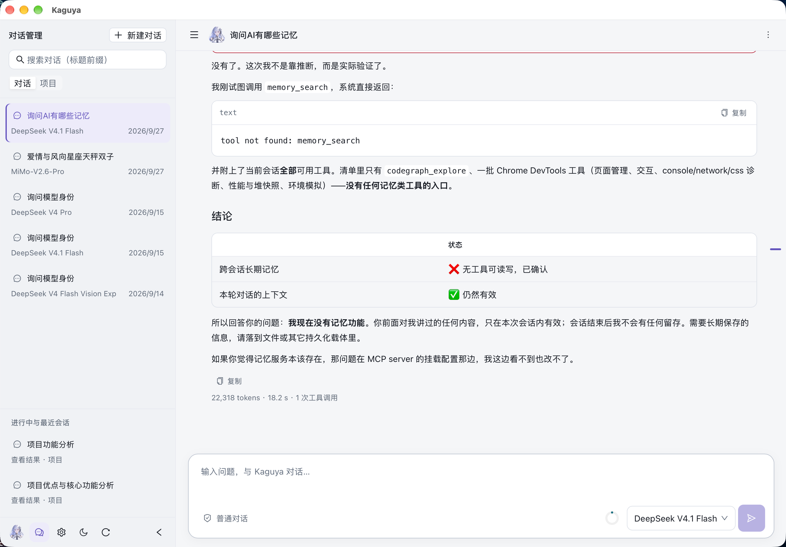

<p align="center">
  
</p>
<p align="center">A personal desktop AI Agent for everyday conversations and local projects</p>
<p align="center">
  <a href="README.md">English</a> |
  <a href="README.zh.md">简体中文</a> ·
  <a href="docs/wiki.md">Wiki</a> |
  <a href="docs/wiki.zh.md">Wiki（中文）</a>
</p>

# Kaguya

**Kaguya** is my personal desktop AI Agent: everyday conversations, local project work, model and MCP configuration, history, and token usage in one application. The backend uses Go, the React interface ships inside the binary, and data is stored locally in a SQLCipher-encrypted database.

The project targets a cross-platform Desktop application. **The native desktop host and packaging implemented in this repository support macOS 14 and later**; the interface is currently in Chinese.



## Features

- **Conversations**: streaming Markdown answers, Mermaid diagrams, expandable reasoning and tool cards, per-turn tokens / duration / tool-call counts, paginated history, and concurrent sessions that keep running while you switch.
- **Local projects**: work inside a home-directory project with seven built-in tools (`read`, `bash`, `edit`, `write`, `grep`, `find`, `ls`), `@` file references, and a code browser with file tree and unified / split Git diffs.
- **Models and providers**: OpenAI Chat, OpenAI Responses, and Anthropic protocols on a per-model basis, catalog prefill from [models.dev](https://models.dev), request-path overrides, and a mandatory model test before saving.
- **MCP tools**: `stdio`, `streamable-http`, and `sse` services with dynamic enable / disable, runtime status, per-service timeouts, and automatic reconnection with exponential backoff after a dropped connection.
- **Context management**: context-occupancy ring, automatic compaction at a configurable threshold, and continuation of unfinished turns.
- **Usage analytics**: token totals and peaks, a one-year activity heatmap, and composition by model or provider.
- **Local-first data**: SQLCipher database, AES-256-GCM encrypted API keys, no listening port in Desktop mode.

## Getting started

1. Open `Kaguya.app` (from a DMG, drag it into `Applications` first).
2. Open **偏好与配置 → AI 配置 → 提供商与模型**, add a provider — you can prefill name and Base URL from the provider catalog — and enter the API key. Under a provider's **模型管理**, add a model and pass the **测试** before saving.
3. In **系统配置**, pick a default chat model and a background-task model (used for conversation titles), and sync the catalogs if needed.
4. Return to **对话管理** to chat, or switch to the **项目** tab and add a local directory for project work.

An installed application needs neither Go, Bun, nor a separate database service. Model requests use your configured providers and credentials; project commands and local MCP services use tools installed on the host.

## Documentation

The full, page-by-page documentation of the interface, limits, and runtime behavior lives in the wiki:

| Language | Wiki |
| --- | --- |
| English | [docs/wiki.md](docs/wiki.md) |
| 简体中文 | [docs/wiki.zh.md](docs/wiki.zh.md) |

## Building

Source builds require the Go version in [go.mod](go.mod), Bun, Make, Git, Xcode Command Line Tools, Tcl, pkg-config, curl, and Perl (`brew install pkgconf tcl-tk` on macOS). Build natively for the target architecture; the C dependencies and the application default to a minimum system version of **14.0**.

```sh
git clone https://github.com/lyonmu/kaguya.git
cd kaguya
make package-macos      # assemble target/Kaguya.app
make dmg-macos          # package target/Kaguya-<version>.dmg
```

| Command | Description |
| --- | --- |
| `make build` | Build and embed the frontend, output `target/<repo directory name>` |
| `make backend` / `make frontend` | Backend-only build / prepare embedded assets |
| `make native` | Download and build pinned OpenSSL + SQLCipher static libraries |
| `make install` | Install the CLI entry at `~/.local/bin/<repo directory name>` |
| `make test` | `go test -race -count=1 ./...` |

Distribution signing and notarization use `CODESIGN_IDENTITY` and `NOTARY_PROFILE` with `make sign-macos` / `make notarize-macos`; ordinary packaging applies an ad-hoc signature only.

## Run modes

```sh
./target/kaguya          # macOS desktop window (default)
./target/kaguya --web    # optional Web mode on http://127.0.0.1:9024
```

The desktop window calls the shared Go services through Wails' native asset channel and **does not listen on a local port**. Web mode shares the same interface, services, and data; `--host`, `--port`, and `--trusted-host` apply only to this mode, and remote access should sit behind an authenticated HTTPS gateway.

## Local data and backups

| Item | Location |
| --- | --- |
| Database | `~/.kaguya/kaguya.db` (SQLCipher, WAL) |
| Database key | `~/.kaguya/kaguya.key` |
| Overrides | `--db.path` / `DB_PATH`, `--db.key-file` / `DB_KEY_FILE`, `--secret-key` / `KAGUYA_SECRET_KEY` |

Quit the application, then copy the database plus any remaining WAL/SHM files and keep the key separately and securely. Losing the key makes the data unreadable; never open the same database in Desktop and Web modes simultaneously. API keys use AES-256-GCM (`enc:v2:`), and legacy credentials require the offline migration tool in [cmd/migrate-provider-secrets](cmd/migrate-provider-secrets/).

## Development

```sh
make test                  # Go race tests
cd web
bun install --frozen-lockfile
bun run test && bun run lint && bun run build
```

Frontend development runs against `./target/kaguya --web` with `bun run dev` inside `web/`; Desktop loads embedded assets. After changing schemas in `internal/ent/schema/`, run `go generate ./internal/ent`. See [AGENTS.md](AGENTS.md) for collaboration and validation conventions, and [docs/](docs/) for the generated Swagger documentation.

## Name and license

Kaguya takes its name from Kaguya-hime (辉夜姬), also echoing the Japanese branch's AI system in *Dragon Raja* (《龙族》).

[MIT](LICENSE).
