<p align="center">
  
</p>
<p align="center">用于日常对话与本地项目工作的个人桌面 AI Agent</p>
<p align="center">
  <a href="README.md">English</a> |
  <a href="README.zh.md">简体中文</a>
</p>

# Kaguya

**Kaguya** 是我个人使用的桌面 AI Agent，将日常对话、本地项目操作、模型与 MCP 配置、历史记录和 Token 用量集中在一个应用中。后端使用 Go，React 界面随应用一起打包，数据保存在本机的 SQLCipher 加密数据库中。

项目以跨平台 Desktop 应用为定位。**当前仓库已实现的原生桌面宿主与应用打包支持 macOS 14 及以上**；以下桌面使用说明以 macOS 应用为准。界面目前使用中文。

## 开始使用

1. 打开 `Kaguya.app`。使用 DMG 时，将应用拖入 `Applications` 后打开。
2. 点击左下角 **系统管理**，进入 **AI 配置 → 提供商与模型**，添加提供商的协议、完整请求地址和 API Key。
3. 在 **系统配置** 中手动或定时同步 [models.dev](https://models.dev/models.json) 目录；可在 **日志与审计 → 模型目录** 检索本地目录（按发布日期从新到旧），或进入提供商的 **模型管理** 选择目录模型，自动填充标识、Token 上限与能力；提供商有差异时仍可编辑。
4. 在 **系统配置** 选择默认对话模型；配置后台任务模型后，可自动生成对话标题。
5. 返回 **对话管理** 开始对话，或切换到 **项目** 添加本机目录后开展项目工作。

已安装的应用运行时不需要 Go、Bun 或独立数据库服务。模型请求使用你配置的提供商与凭据；项目命令和本地 MCP 服务使用主机上已安装的工具。

## 功能与使用

以下截图于 **2026-09-13** 拍摄自本机已安装的 `Kaguya.app`。截图中的提供商、模型、MCP 服务、设置和用量属于该实例，**不代表内置默认值或上游能力保证**；例如截图中的最大步数为 128、压缩比例为 50%，产品默认值仍以设置表为准。提供商列表按名称筛选，API Key 保持掩码显示。

### 对话与历史

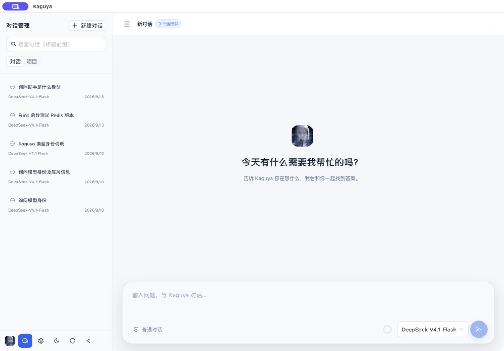

- **流式回答**：支持 Markdown、表格、代码高亮和复制；提供商返回的思考内容、工具参数与结果可独立展开查看。
- **Mermaid 图表**：回答中的 Mermaid 代码块在生成完成后渲染，支持缩放、平移、下载和源码切换。Markdown 图片由用户点击后加载。
- **模型选择**：输入框按“提供商 → 模型”选择模型；收起时显示模型名称，未单独指定时使用系统默认对话模型。
- **多会话并行**：切换对话或进入系统页面时，正在生成的会话继续运行；可查看运行中的会话并分别停止。同一会话一次运行一轮。
- **会话管理**：新建、按标题前缀搜索、续聊、重命名和删除；支持重新加载历史；历史分页查看，轮次摘要显示 Token、耗时和工具调用次数。
- **上下文管理**：输入框显示最近一次模型调用的上下文占用。达到配置阈值后自动摘要早期内容，保留近期消息与原始历史；摘要随成功轮次保存，后续续聊复用。模型窗口未知时显示未知占用并跳过自动压缩。

**Enter** 发送，**Shift + Enter** 换行。生成时可点击停止；停止、失败或断联的轮次保留已生成的内容与工具记录。下次续聊会保留未完成轮次的用户提问，半截助手回答与工具记录只用于展示。关闭应用、刷新页面或流式连接断开会中断当前轮次。

### 本地项目工作区

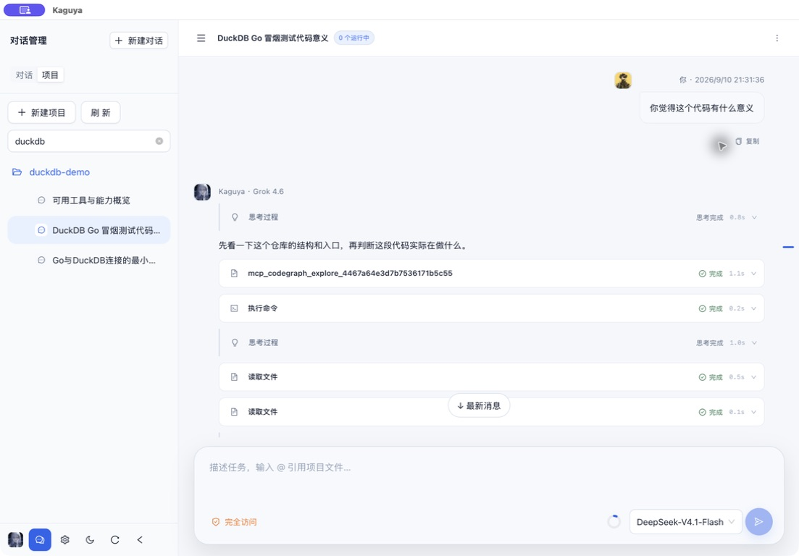

在侧栏 **项目** 中可按名称前缀搜索项目，选择当前用户主目录下的已有文件夹，可编辑项目名称、路径与描述，并在项目下创建多个会话。普通对话与项目对话分别显示。项目路径须唯一；删除项目保留会话，将其转为普通对话，不删除本机文件。

项目会话启用以下四个内置工具，以项目目录作为工作目录：

| 工具 | 用途 |
| --- | --- |
| `read` | 分页读取文本或读取模型可识别的图片 |
| `bash` | 执行主机命令，返回标准输出与错误输出，支持超时和取消 |
| `edit` | 定位并替换文件内容，返回修改差异 |
| `write` | 新建或覆盖文件，按需创建父目录 |

在输入框输入 **@** 搜索项目文件，用 ↑/↓ 选择、Enter 添加、Esc 关闭。文件作为可移除的引用卡片展示，发送时读取文本内容；每条消息最多引用 **8** 个文件，单文件最多 **2000 行 / 50 KiB**，总量最多 **256 KiB**。

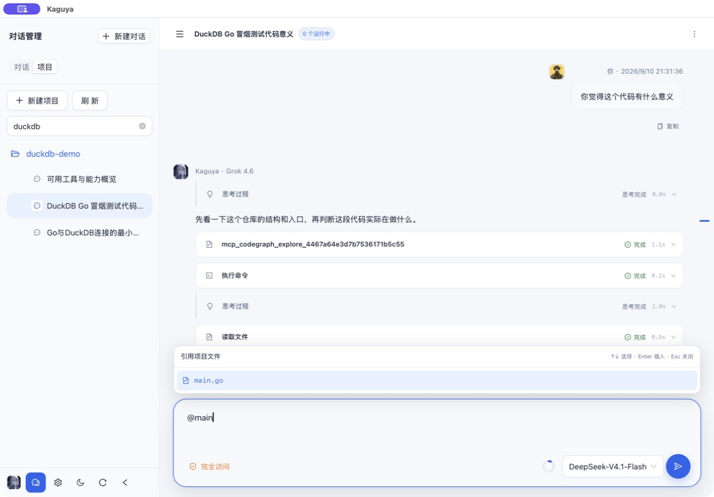

项目会话顶部菜单的 **查看代码与改动** 提供文件树、代码预览和 Git 未提交变更。差异支持统一与左右分栏视图；文件树遵循 `.gitignore` / `.dockerignore` 并跳过常见依赖目录。文本预览上限 **512 KiB**，单文件差异上限 **1 MiB**。非 Git 目录也可以浏览文件。

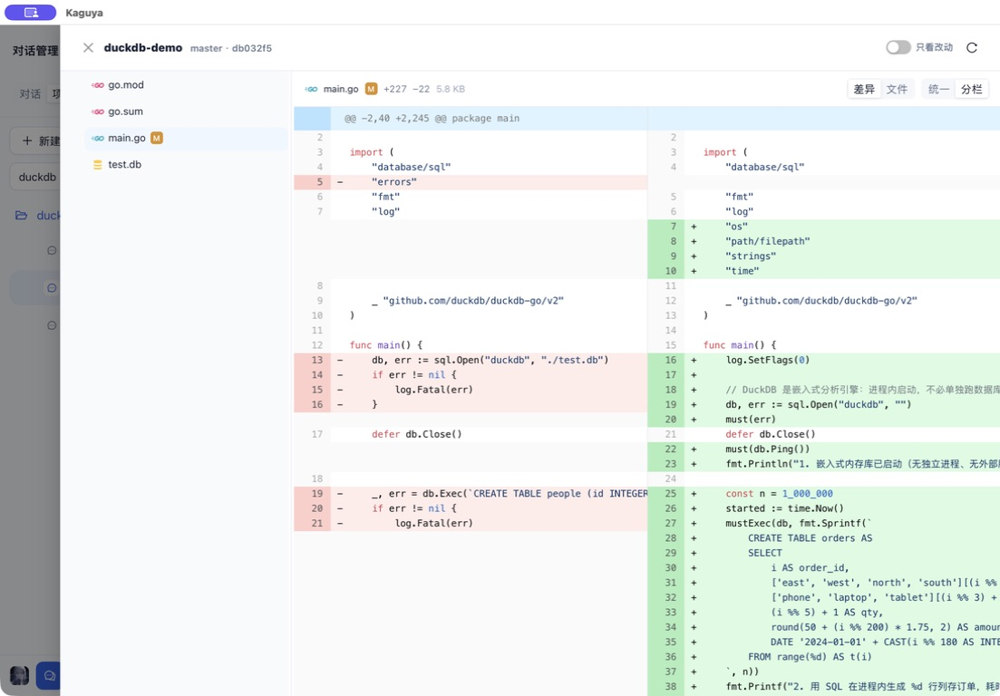

<details>
<summary>查看统一差异与文件预览</summary>

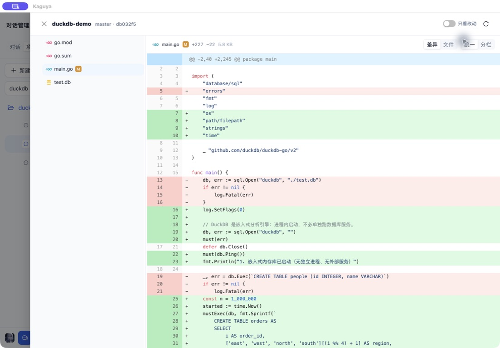

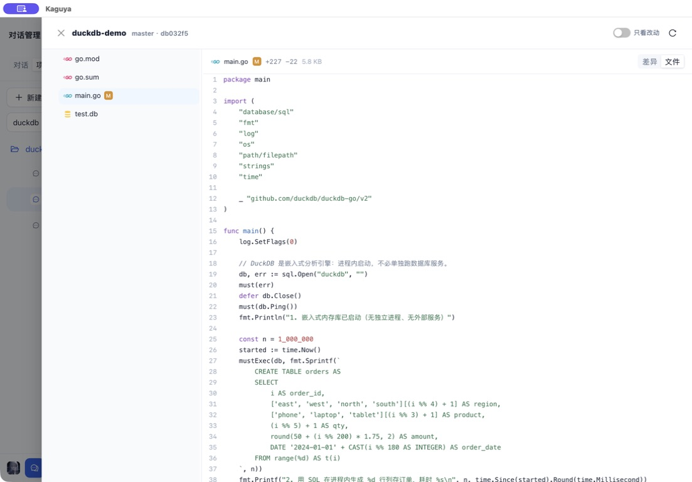

</details>

文件工具通过 `os.Root` 限制项目路径；**Bash 与本地 MCP 进程使用当前用户权限，工作目录不是沙箱**。文件修改和外部操作立即生效，停止对话不会撤销它们。长命令输出会截断展示，超出展示范围的输出保存到 `/tmp/kaguya/YYYYMMDD/<conversation-id>/`，供当前会话分页读取，清理由操作系统临时目录机制负责。

### 提供商与模型

入口：**系统管理 → AI 配置 → 提供商与模型**。

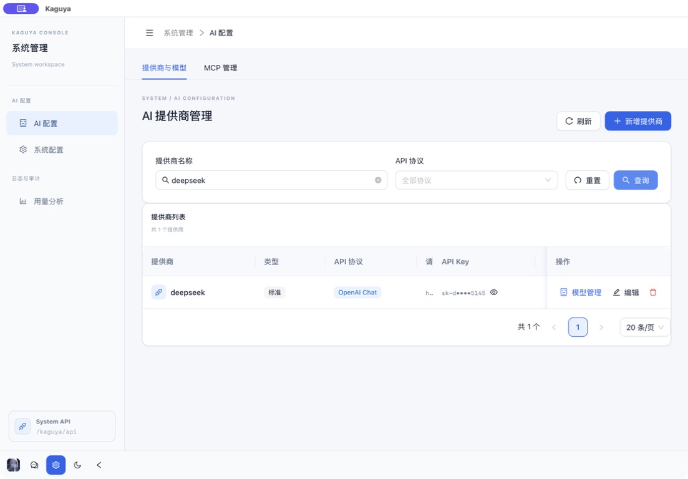

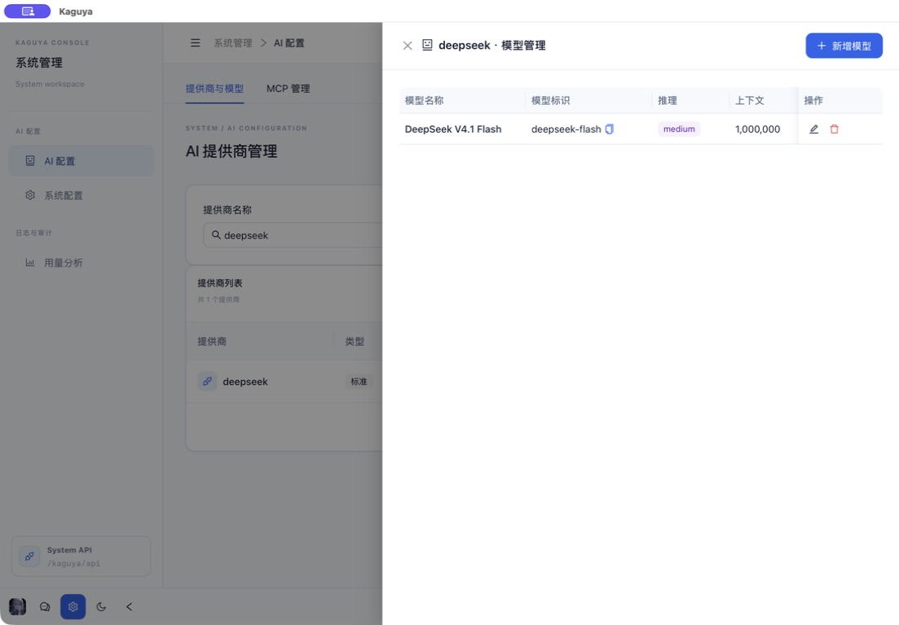

| 协议 | 配置值 | 完整请求地址示例 |
| --- | --- | --- |
| OpenAI Chat Completions | `openai-chat` | `https://api.example.com/v1/chat/completions` |
| OpenAI Responses | `openai-response` | `https://api.example.com/v1/responses` |
| Anthropic Messages | `anthropic` | `https://api.example.com/v1/messages` |

将示例域名替换为实际提供商地址。**必须填写完整端点路径**，应用不会自动补上 `/chat/completions`、`/responses` 或 `/messages`。提供商类型支持普通类型 `normal` 和带 OpenCode 会话头的 `opencode-go`。

模型配置包含显示名称、上游模型标识、思考等级、上下文窗口、最大输出 Token，以及 Tool/Vision/JSON 能力元数据。同步后的 models.dev 目录可自动填充这些字段，但不保证当前提供商一定开放该模型；仍需核对提供商可用性并按需调整。项目与 MCP 工具调用依赖模型支持工具，图片读取还依赖视觉能力。

API Key 加密存储，列表默认掩码显示，显式查看时才返回原文；编辑时留空会保留已有 Key。界面中的模型与提供商来自个人配置，应用不预设默认对话模型或后台任务模型。

### MCP 工具

入口：**系统管理 → AI 配置 → MCP 管理**。

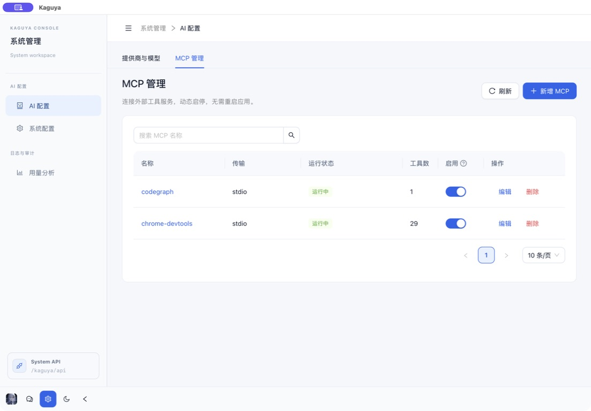

可以搜索、添加、编辑、删除服务，动态启用或停用，并查看连接状态、工具数量和错误信息。

| 传输方式 | 配置内容 |
| --- | --- |
| `stdio` | 可执行命令、JSON 参数数组、环境变量、可选的绝对工作目录 |
| `streamable-http` | 服务 URL 与 HTTP 请求头 |
| `sse` | SSE URL 与 HTTP 请求头 |

新服务默认停用，启用时连接并发现工具；重启应用会恢复已启用服务。修改正在启用的服务时，先验证新连接，失败则保留原配置。启用的 MCP 工具从下一次请求起供普通对话和项目对话使用，标题任务不使用工具。停用或删除服务会关闭连接并取消正在执行的 MCP 请求。

工具超时可设 **1–600 秒**。HTTP 认证通过请求头配置；本地服务继承应用进程环境，可在服务配置中显式补充环境变量。

### 系统配置

入口：**系统管理 → 系统配置**。

| 设置 | 行为 |
| --- | --- |
| 默认对话模型 | 未手动选择模型时使用 |
| 后台任务模型 | 用于生成对话标题，可与对话模型不同 |
| Agent Loop 最大步数 | 默认 `0`，表示不限；可设 `1–1000`，达到上限后保存进度，可继续执行 |
| 命令超时 | Bash 默认和最大超时，默认 `120` 秒，可设 `1–86400` 秒；模型可请求更短时间 |
| 聊天请求最大重试次数 | 默认 `5`，范围 `0–20`；对限流、过载等临时错误退避重试，已输出内容后不重试 |
| 会话压缩比例 | 默认 `90%`，范围 `10–95%`；其余窗口预留输出 |
| 全局 AGENTS.md 路径 | 按顺序加载个人指令；清空列表可禁用全局文件加载 |
| 模型目录同步 | 可配置完整 HTTP(S) 目录地址（默认 `https://models.dev/models.json`），手动同步或启用 `1–720` 小时的周期同步；“日志与审计 → 模型目录”支持按名称、标识、实验室、系列或描述检索，并按发布日期从新到旧显示 |
| 全局基础提示词 | 可编辑的新聊天基础人设，也可留空 |
| 附加系统提示词 | 追加到基础提示词之后，用于聊天 |

默认全局指令路径为 `~/.config/agents/AGENTS.md` 和 `~/.codex/AGENTS.md`，项目根目录的 `AGENTS.md` 自动加入，文件名大小写不敏感。指令在会话首次成功轮次保存快照，之后跨重启、压缩复用；修改文件或路径后，新会话使用新内容。全局和项目指令合计上限 **256 KiB**。

其他设置保存后对新请求生效。界面提供明暗主题切换和可收起的侧栏。

### Token 用量分析

入口：**系统管理 → 用量分析**。

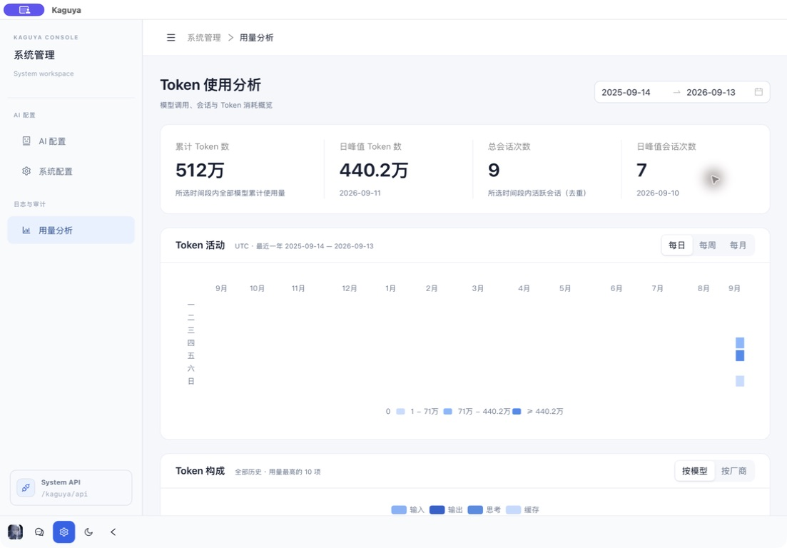

- 日期范围控制汇总卡片：总 Token、日峰值 Token、活跃会话数和日会话峰值。
- 活动热力图固定显示最近一年，可按日、周、月聚合。
- 构成图按全部历史展示用量前十的模型或提供商，分别显示输入、输出、思考和缓存读取。

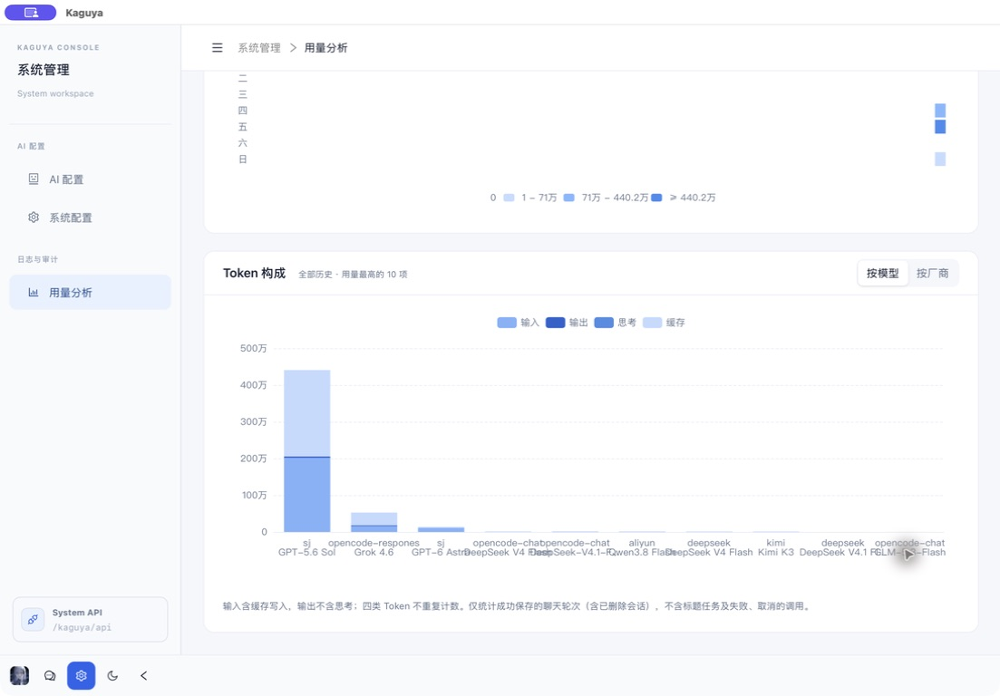

日期按 **UTC** 统计。只计入成功完成的聊天轮次，已删除会话的历史消耗仍保留；上下文摘要用量计入聊天轮次，标题任务及未完成轮次不计入。因此该页面反映应用记录的聊天用量。

## 安装与构建

### macOS 桌面应用

源码构建需要 [go.mod](go.mod) 指定的 Go（当前 `1.26.8`）、Bun、Make、Git、Xcode Command Line Tools、Tcl、pkg-config、curl 和 Perl。macOS 上可用 `brew install pkgconf tcl-tk` 补充依赖。

```sh
git clone https://github.com/lyonmu/kaguya.git
cd kaguya
make package-macos
# 打开 target/Kaguya.app，或复制到 Applications
```

`make package-macos` 构建前后端并组装 `target/Kaguya.app`。`make dmg-macos` 生成可拖拽安装的 `target/Kaguya-<版本>.dmg`。在目标架构的 macOS 上原生构建；C 依赖与应用最低系统版本默认均为 **14.0**。

```sh
make build                 # 构建 target/kaguya
./target/kaguya             # 打开桌面窗口
mkdir -p ~/.local/bin
make install               # 构建并安装命令行入口到 ~/.local/bin/kaguya
```

输出二进制名称跟随仓库目录名。`make native` 自动下载并校验固定版本的 OpenSSL / SQLCipher，构建静态库；运行应用无需另装这些共享库。构建必须启用 CGO，使用 Make 目标以带上 SQLCipher 链接参数。

发行签名与公证使用已有脚本，由发行环境提供身份与钥匙串配置：

```sh
CODESIGN_IDENTITY='Developer ID Application: Name (TEAMID)' make sign-macos
CODESIGN_IDENTITY='Developer ID Application: Name (TEAMID)' \
  NOTARY_PROFILE=kaguya make notarize-macos
```

普通打包目标自动对完整应用包进行 ad-hoc 临时签名，无需证书或 Apple 账号；DMG 本身不签名。这不会获得 Apple 的开发者信任。同事安装后首次打开若被拦截，可在确认来源可信后，前往“系统设置 → 隐私与安全性 → 仍要打开”手动放行。邮箱不能直接用作签名身份，正式发行仍需 Apple 颁发的 Developer ID Application 证书。公证 Profile 默认名为 `kaguya`，需提前通过 `notarytool` 配置对应的钥匙串凭据；公证目标同时处理应用和 DMG。

### 桌面运行环境

桌面窗口通过 Wails 原生资源通道调用同一套 Go 服务，**不监听本地网络端口**。外部链接交给系统浏览器，复制使用系统剪贴板；模型和远程 MCP 请求仍按配置访问网络。

从 Finder 启动时，应用会尝试通过登录 shell 补充 `PATH`，方便找到 Homebrew、Bun、uvx 等命令；失败或 5 秒超时后保留原 `PATH`。此步骤只补充 `PATH`。需要终端中的代理变量等环境时，可从终端运行 `/Applications/Kaguya.app/Contents/MacOS/kaguya`。项目所需的 Bash、Git 和其他工具链须在主机上可用。

### 可选 Web 模式

```sh
./target/kaguya --web
```

浏览器打开 [http://127.0.0.1:9024](http://127.0.0.1:9024)。Web 使用同一套界面、服务和数据，主要用于浏览器访问与前端开发。`--host`、`--port`、`--trusted-host` 只适用于此模式。远程访问应通过带身份验证的 HTTPS 网关，保留原始 Host / Origin / Sec-Fetch-Site，并通过 `--trusted-host` 放行准确的主机名。

## 本地数据与备份

| 内容 | 默认位置 / 行为 |
| --- | --- |
| 数据库 | `~/.kaguya/kaguya.db`，SQLCipher 加密 SQLite，WAL 模式 |
| 数据库密钥 | `~/.kaguya/kaguya.key`，全新安装首次启动自动生成 |
| 提供商、模型、MCP、系统配置与会话 | 保存在数据库中 |
| 自定义数据库位置 | `--db.path` / `DB_PATH` |
| 自定义密钥文件 | `--db.key-file` / `DB_KEY_FILE`，指定文件必须已存在 |
| API Key 独立加密密钥 | `--secret-key` / `KAGUYA_SECRET_KEY`；未指定时由数据库密钥派生 |

应用包仅包含程序与静态资源，升级应用不会把数据写进 `.app`。主程序通过 CLI / 环境变量接收启动参数，模型与提示词在界面配置。

备份时退出应用，复制数据库及仍存在的 WAL/SHM 文件，并单独安全保存密钥；使用独立 API Key 加密密钥时也须保留它。丢失密钥将无法解密数据。不要替换已有数据库的密钥，不要同时用 Desktop 和 Web 打开同一个数据库。数据库与密钥同时丢失或被窃取时，文件加密无法替代主机访问保护。

API Key 使用 AES-256-GCM（`enc:v2:`）。旧凭据格式需通过 [离线迁移工具](cmd/migrate-provider-secrets/) 在数据库副本上转换，启动不会原地重写旧数据。

## 项目结构与开发

```text
桌面窗口 / 可选 Web 界面
        │ JSON + POST SSE
        ▼
Go 启动与路由 → 应用服务 → Fantasy Agent → 模型提供商
                    ├── 项目文件工具 / MCP 工具
                    └── Ent → SQLCipher 本地数据库
```

| 目录 | 职责 |
| --- | --- |
| `main.go`, `internal/cmd/`, `internal/config/` | CLI、运行模式、共享初始化与关停 |
| `internal/desktop/` | 原生窗口、资源通道、系统集成与启动环境 |
| `internal/router/`, `internal/api/`, `internal/dto/` | 路由、请求处理与数据契约 |
| `internal/service/agent/` | 聊天、历史、标题、指令快照与上下文压缩 |
| `internal/service/project/` | 项目管理、文件浏览和 Git 差异 |
| `internal/service/system/` | 提供商、模型、MCP 配置、设置与用量 |
| `internal/agent/runtime/`, `internal/agent/token/` | Fantasy 模型执行与用量记录 |
| `internal/agent/tools/`, `internal/agent/mcp/` | 内置文件/命令工具与 MCP 连接生命周期 |
| `internal/db/`, `internal/secret/`, `internal/ent/schema/` | 数据库、凭据加密与手写 schema |
| `web/` | React / TypeScript 界面与测试 |
| `build/darwin/`, `scripts/` | 桌面资源、原生依赖和打包脚本 |
| `docs/` | 生成的 Swagger 文档 |

```sh
make test                  # SQLCipher + Go race tests
cd web
bun install --frozen-lockfile
bun run test
bun run lint
bun run build
```

前端开发先从仓库根目录运行 `./target/kaguya --web`，再在 `web/` 执行 `bun run dev`。Desktop 加载嵌入资源，修改前端后需重新构建并重启应用。

Ent schema 在 `internal/ent/schema/` 修改后执行 `go generate ./internal/ent`。API 路由与 DTO 分别见 [internal/router/v1/](internal/router/v1/) 和 [internal/dto/](internal/dto/)；Web 模式默认 Swagger 地址为 `/kaguya/api/swagger/index.html`，Prometheus 为 `/kaguya/api/metrics`。更多协作与验证约定见 [AGENTS.md](AGENTS.md)。

## 名称与许可证

Kaguya 取自辉夜姬（Kaguya-hime），也呼应《龙族》中日本分部的人工智能系统名称。

[MIT](LICENSE)。
